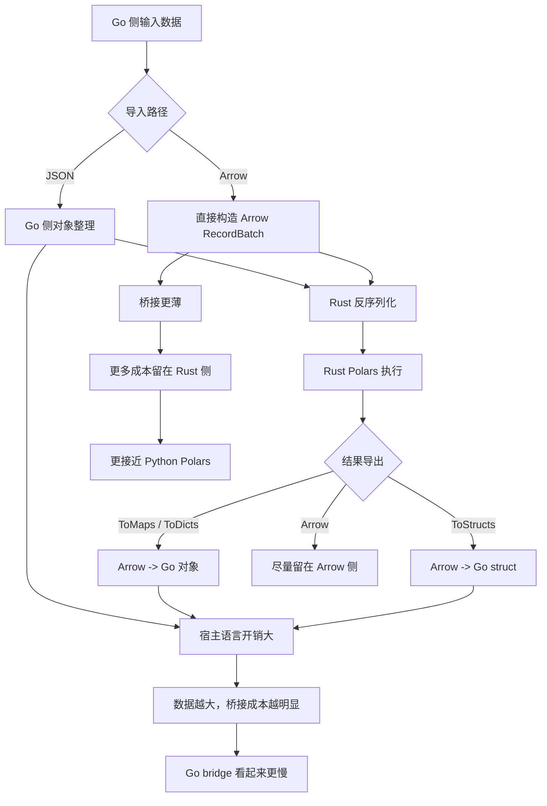
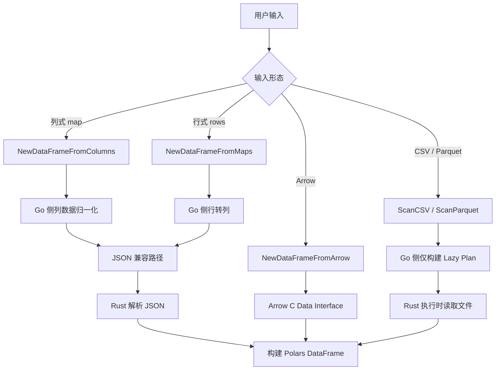

# Go Bridge vs Python Polars

这份文档记录一套“同机器、近似同口径”的对比流程，用来观察本仓库和 Python Polars 在常见数据处理路径上的端到端差异。

## 一页摘要

- 当前最明显的瓶颈是 Go 侧的内存导入路径，尤其是默认 `json` 导入；`arrow` 路径能把这部分成本显著压下去。
- `CollectOnly` 很轻，说明 `lazy -> collect` 和查询执行不是主瓶颈。
- `ToMaps()` / `ToStructs()` 有成本，但不是最重的一层。
- `GroupBy` 和 `Join` 的主要开销更多在输入构建和执行阶段，导出阶段次之。
- 文件扫描型 workload 仍然是 Go bridge 的强项。
- 这份对比基准统一按列式输入跑，Go 侧显式走 `NewDataFrameFromColumns(...)`，和 Python 的 `dict of lists` 对齐。

## 因果图



这张图的核心结论是：

 - Python 大数据更占优，通常不是因为 Python 算子更强，而是因为它更少在宿主语言边界上搬数据。
 - 你现在的 Go bridge 在默认 `json` 路径下，会把更多成本放在 Go 侧的对象构建、序列化和结果物化上。
 - `arrow` 路径已经证明，桥接越薄，性能和内存越接近 Python Polars。

## 输入流转图



这张图对应的是仓库里最常见的 4 条读入路径：

- `NewDataFrameFromColumns(...)` 适合已经是列式数据的场景，和 Python 的 `dict of lists` 对齐。
- `NewDataFrameFromMaps(...)` 适合 `list of dicts`，但会多一层行转列。
- `NewDataFrameFromArrow(...)` 适合已经有 Arrow 数据的高性能路径。
- `ScanCSV(...)` / `ScanParquet(...)` 走的是 lazy scan，Go 侧只建计划，真正读文件的是 Rust。

## 对比目标

这里关注的是更贴近业务接入的整体路径，而不是只盯底层算子：

- 内存 DataFrame 上的 `filter + select + materialize`
- `ToMaps()` / `to_dicts()`
- CSV / Parquet 扫描后再物化
- `GroupBy().Agg(...)`
- `Join(...)`
- NDJSON 文件 sink

说明：

- Go 侧结果包含 Go <-> Rust 桥接以及结果物化成本。
- Python 侧结果包含 Python 对象物化成本。
- 两边底层都使用 Rust Polars，但宿主语言对象导出路径不同。
- 当前这版脚本会尽量做更严格的控制变量：
  - 两边都优先按列构造内存 DataFrame
  - 每个 case 只初始化自己真正需要的对象
  - 峰值内存对照使用“每个 case 单独进程”的方式采集

## 脚本

仓库提供两份可复跑脚本：

- `scripts/compare_python_polars.py`
  负责生成共享 CSV / Parquet fixture，并运行 Python Polars 对照。
- `scripts/compare_go_polars.go`
  负责运行本仓库 Go bridge 的同口径场景。
- `scripts/compare_with_python_polars.sh`
  一次性串起 fixture 准备、Python 对照和 Go bridge 对照。
- `scripts/compare_memory_with_python_polars.sh`
  以“每个 case 单独进程”的方式跑内存对照，并输出 `memory_mib`。

补充：

- `memory_mib` 是脚本当前输出的统一内存字段名。
- Python 侧当前基于 `resource.getrusage(...).ru_maxrss`。
- Go 侧当前基于 `runtime.MemStats.Sys`，这是为了保持 Windows 可编译。

- `scripts/compare_go_polars.go` 以及两个 shell 脚本现在支持 `--import-mode` / `--go-import-mode`
  可以在 Go 侧切换 `json` 和 `arrow` 两种内存导入方式。

## 运行方式

先准备共享 fixture：

```bash
/path/to/python-with-polars scripts/compare_python_polars.py --prepare-only
```

然后分别跑 Python 和 Go：

```bash
/path/to/python-with-polars scripts/compare_python_polars.py
go run ./scripts/compare_go_polars.go
```

如果想一条命令跑完整套：

```bash
scripts/compare_with_python_polars.sh --python /path/to/python-with-polars
```

如果想换 fixture 目录：

```bash
/path/to/python-with-polars scripts/compare_python_polars.py --fixture-dir /tmp/polars-go-compare
go run ./scripts/compare_go_polars.go --fixture-dir /tmp/polars-go-compare
```

默认参数：

- fixture 目录：`/tmp/polars-go-compare`
- 行数：`4000,16000`

大样本示例：

```bash
scripts/compare_with_python_polars.sh \
  --python /path/to/python-with-polars \
  --fixture-dir /tmp/polars-go-compare-large \
  --sizes 100000,1000000
```

如果想专门验证 Go 内存导入路径：

```bash
scripts/compare_with_python_polars.sh \
  --python /path/to/python-with-polars \
  --fixture-dir /tmp/polars-go-compare-large \
  --sizes 100000 \
  --go-import-mode arrow
```

如果想看峰值内存：

```bash
scripts/compare_memory_with_python_polars.sh \
  --python /path/to/python-with-polars \
  --fixture-dir /tmp/polars-go-compare-large \
  --sizes 100000
```

## 当前样例结果

测试环境：

- 日期：`2026-03-28`
- 机器：Apple M4 Pro
- Python Polars：`1.35.2`
- 口径：按列输入，Go 侧显式走 `NewDataFrameFromColumns(...)`，Python 侧使用 `dict of lists`

### 吞吐对比

| 场景 | Python | Go JSON | Go Arrow |
|---|---:|---:|---:|
| ImportOnly | `345 / 1345` | `1878 / 7306` | `174 / 367` |
| CollectOnly | `85 / 79` | `132 / 241` | `155 / 129` |
| QueryCollectLike | `1168 / 4476` | `2151 / 8039` | `787 / 1803` |
| ToDicts / ToMaps | `1289 / 5977` | `669 / 3143` | `746 / 2391` |
| ScanCSV | `1234 / 3930` | `1001 / 3288` | `912 / 2584` |
| ScanParquet | `1029 / 3657` | `729 / 2649` | `682 / 1644` |
| GroupByImportOnly | `361 / 1326` | `1627 / 6718` | `122 / 334` |
| GroupByCollectOnly | `197 / 298` | `308 / 487` | `234 / 323` |
| GroupByExportOnly | `2 / 2` | `6 / 8` | `6 / 8` |
| GroupByAgg | `170 / 276` | `274 / 397` | `228 / 376` |
| JoinImportOnly | `381 / 1436` | `1909 / 7605` | `114 / 304` |
| JoinCollectOnly | `308 / 399` | `560 / 523` | `338 / 529` |
| JoinExportOnly | `1008 / 4623` | `508 / 1776` | `428 / 1538` |
| JoinInner | `1462 / 5210` | `1030 / 2516` | `786 / 1928` |
| SinkNDJSONFile | `583 / 726` | `459 / 609` | `296 / 486` |

这里每个单元格都是 `4000 行 / 16000 行`。

### 峰值内存对比

| 场景 | Python | Go JSON | Go Arrow |
|---|---:|---:|---:|
| ImportOnly | `68.9 / 76.1` | `25.1 / 33.0` | `25.1 / 33.0` |
| CollectOnly | `71.5 / 76.8` | `29.6 / 33.4` | `29.6 / 33.4` |
| QueryCollectLike | `73.5 / 88.6` | `36.3 / 48.0` | `36.3 / 48.0` |
| ToDicts / ToMaps | `73.2 / 93.0` | `28.0 / 39.8` | `28.0 / 39.8` |
| ScanCSV | `87.0 / 102.2` | `41.2 / 49.5` | `41.2 / 49.5` |
| ScanParquet | `86.1 / 102.5` | `49.7 / 58.4` | `49.7 / 58.4` |
| GroupByImportOnly | `68.8 / 76.1` | `25.7 / 32.6` | `25.7 / 32.6` |
| GroupByCollectOnly | `72.6 / 79.0` | `31.0 / 34.7` | `31.0 / 34.7` |
| GroupByExportOnly | `70.2 / 74.7` | `30.5 / 34.2` | `30.5 / 34.2` |
| GroupByAgg | `72.3 / 78.6` | `31.0 / 35.2` | `31.0 / 35.2` |
| JoinImportOnly | `68.9 / 73.7` | `25.4 / 31.8` | `25.4 / 31.8` |
| JoinCollectOnly | `76.3 / 80.4` | `39.5 / 45.0` | `39.5 / 45.0` |
| JoinExportOnly | `73.5 / 91.2` | `44.1 / 54.8` | `44.1 / 54.8` |
| JoinInner | `80.2 / 98.1` | `46.1 / 57.1` | `46.1 / 57.1` |
| SinkNDJSONFile | `80.6 / 88.7` | `42.1 / 46.1` | `42.1 / 46.1` |

### 结论

- 这次已经是**真正的列式对比**，不是行式输入混在一起了。
- `CollectOnly` 仍然很轻，说明 query 执行本身不是主瓶颈。
- `ImportOnly` 仍然是最明显的差距点，Go 的 `json` 入口最重，`arrow` 明显更接近 Python。
- `GroupByExportOnly` 基本可以忽略，说明导出不是 groupby 的主要成本。
- `JoinCollectOnly` 和 `JoinExportOnly` 都有成本，但主瓶颈仍然更偏输入和执行阶段。

## group_by / join 细分

在上面那轮拆分基础上，又把 `GroupBy` 和 `Join` 额外切成了三段：

- `ImportOnly`：只看输入构建
- `CollectOnly`：只看执行
- `ExportOnly`：只看结果导出

这轮只跑了 Go `arrow` 路径，测试环境仍然是：

- 日期：`2026-03-28`
- 机器：Apple M4 Pro
- Python Polars：`1.35.2`

### 吞吐对比

| 场景 | Python | Go Arrow |
|---|---:|---:|
| GroupByImportOnly | `320 / 1234` | `114 / 317` |
| GroupByCollectOnly | `180 / 259` | `275 / 319` |
| GroupByExportOnly | `2 / 2` | `6 / 11` |
| GroupByAgg | `202 / 311` | `224 / 284` |
| JoinImportOnly | `366 / 1370` | `112 / 318` |
| JoinCollectOnly | `321 / 417` | `401 / 436` |
| JoinExportOnly | `926 / 4403` | `466 / 1514` |
| JoinInner | `1483 / 5099` | `792 / 1941` |

### 峰值内存对比

| 场景 | Python | Go Arrow |
|---|---:|---:|
| GroupByImportOnly | `69.1 / 76.5` | `25.0 / 32.7` |
| GroupByCollectOnly | `72.7 / 78.4` | `31.1 / 34.8` |
| GroupByExportOnly | `70.1 / 74.9` | `30.0 / 34.2` |
| GroupByAgg | `72.2 / 78.3` | `31.3 / 35.3` |
| JoinImportOnly | `69.0 / 73.9` | `25.3 / 31.5` |
| JoinCollectOnly | `76.4 / 80.9` | `39.4 / 44.6` |
| JoinExportOnly | `73.0 / 91.1` | `44.5 / 54.8` |
| JoinInner | `80.2 / 99.0` | `45.2 / 57.0` |

### 结论补充

- `GroupByExportOnly` 基本可以忽略，说明 groupby 的主要成本在输入和执行，不在最终导出。
- `JoinExportOnly` 比 `JoinCollectOnly` 更重，但整体仍然是 `Join` 执行阶段和输入阶段更关键。
- 新拆分进一步支持前面的判断：要优先盯住输入构建和查询执行，而不是只优化最终 `to_dicts()` / `ToMaps()`。

## Arrow 导入实验

为了验证 Go 侧内存 DataFrame 路径是不是主要被兼容 JSON 导入拖慢，额外做了一轮 `100k` 的 Go-only 对照。

测试方式：

- 同样的 case
- 同样的 Go 脚本
- 只切换 `--import-mode json` 和 `--import-mode arrow`

结果：

| 场景 | Go JSON import | Go Arrow import | 变化 |
|---|---:|---:|---|
| QueryCollect-like | `52930 us/op`, `334.3 MiB` | `10321 us/op`, `121.1 MiB` | Arrow 明显更好 |
| GroupByAgg | `45661 us/op`, `327.9 MiB` | `3531 us/op`, `65.2 MiB` | Arrow 明显更好 |
| JoinInner | `62099 us/op`, `394.8 MiB` | `13531 us/op`, `158.9 MiB` | Arrow 明显更好 |
| SinkNDJSONFile | `45776 us/op`, `330.7 MiB` | `3803 us/op`, `81.3 MiB` | Arrow 明显更好 |

这说明前面那批“内存 DataFrame 上 Python 更快”的结果，很大概率不是 Polars 算子本身不行，而是 Go 侧当前默认的内存导入路径太重。

## 最新复跑结果

为了更直接回答“当前实现里，导入 / 处理 / 导出三段各自差多少”，我在同一台机器上又补跑了一轮分段对比。

这轮口径和前面的样例不同，分两部分看：

- 导入：Python 使用 `pl.from_dicts(..., schema=...)`，Go 使用 `NewDataFrameFromMaps(..., WithSchema(...))`
- 处理 / 导出：Python 和 Go 都使用共享 fixture；Go 侧显式走 `--import-mode arrow`，尽量把加载方式的影响压低，重点观察进入 Polars 之后的处理和导出差异

测试环境：

- 日期：`2026-03-28`
- 机器：Apple M4 Pro
- Python Polars：`1.35.2`

### 分段吞吐对比

| 阶段 | 场景 | Python | Go | 结论 |
|---|---|---:|---:|---|
| 导入 | `from_dicts/maps` `2000` 行 | `910 us/op` | `4918 us/op` | Go 约慢 `5.4x` |
| 导入 | `from_dicts/maps` `10000` 行 | `2683 us/op` | `23578 us/op` | Go 约慢 `8.8x` |
| 导入 | `from_dicts/maps` `100000` 行 | `31006 us/op` | `242591 us/op` | Go 约慢 `7.8x` |
| 导入 | `from_dicts/maps` `1000000` 行 | `530326 us/op` | `3383736 us/op` | Go 约慢 `6.4x` |
| 处理 | `collect_only` `4000` 行 | `86 us/op` | `327 us/op` | Go 约慢 `3.8x` |
| 处理 | `collect_only` `100000` 行 | `336 us/op` | `3402 us/op` | Go 约慢 `10.1x` |
| 处理 | `collect_only` `1000000` 行 | `11488 us/op` | `33934 us/op` | Go 约慢 `3.0x` |
| 处理 | `group_by_collect_only` `4000` 行 | `175 us/op` | `1088 us/op` | Go 约慢 `6.2x` |
| 处理 | `group_by_collect_only` `100000` 行 | `4200 us/op` | `11239 us/op` | Go 约慢 `2.7x` |
| 处理 | `group_by_collect_only` `1000000` 行 | `16194 us/op` | `121097 us/op` | Go 约慢 `7.5x` |
| 处理 | `join_collect_only` `4000` 行 | `327 us/op` | `1528 us/op` | Go 约慢 `4.7x` |
| 处理 | `join_collect_only` `100000` 行 | `6861 us/op` | `16502 us/op` | Go 约慢 `2.4x` |
| 处理 | `join_collect_only` `1000000` 行 | `18193 us/op` | `191474 us/op` | Go 约慢 `10.5x` |
| 导出 | `to_maps` `4000` 行 | `1483 us/op` | `778 us/op` | Go 约快 `1.9x` |
| 导出 | `to_maps` `100000` 行 | `44711 us/op` | `16663 us/op` | Go 约快 `2.7x` |
| 导出 | `to_maps` `1000000` 行 | `653895 us/op` | `259798 us/op` | Go 约快 `2.5x` |
| 导出 | `join_export_only` `4000` 行 | `999 us/op` | `499 us/op` | Go 约快 `2.0x` |
| 导出 | `join_export_only` `100000` 行 | `37699 us/op` | `10888 us/op` | Go 约快 `3.5x` |
| 导出 | `join_export_only` `1000000` 行 | `532299 us/op` | `157233 us/op` | Go 约快 `3.4x` |

### 最新结论

- 当前最大差距仍然在“Go 对象进入 Rust/Polars”的导入阶段。
- 进入 Polars 之后，处理阶段仍有差距，但已经明显小于导入阶段。
- 结果导出回宿主语言对象时，当前 Go 侧 `ToMaps()` / join 导出反而更快。
- 所以现在如果继续做性能优化，优先级仍然应该是“继续压加载桥接成本”，而不是先盯 `ToMaps()` 或最终结果导出。

### 分段内存对比

说明：

- Python `memory_mib` 基于 `ru_maxrss`
- Go `memory_mib` 基于 `runtime.MemStats.Sys`
- 这组结果更适合看趋势和量级，不适合作为严格等价的 peak RSS 对照

| 阶段 | 场景 | Python | Go |
|---|---|---:|---:|
| 导入 | `from_dicts/maps` `100000` 行 | `113.6 MiB` | `109.1 MiB` |
| 导入 | `from_dicts/maps` `1000000` 行 | `704.5 MiB` | `965.0 MiB` |
| 处理 | `collect_only` `100000` 行 | `134.1 MiB` | `37.9 MiB` |
| 处理 | `collect_only` `1000000` 行 | `667.3 MiB` | `283.9 MiB` |
| 处理 | `group_by_collect_only` `100000` 行 | `132.5 MiB` | `41.9 MiB` |
| 处理 | `group_by_collect_only` `1000000` 行 | `630.6 MiB` | `294.8 MiB` |
| 处理 | `join_collect_only` `100000` 行 | `150.9 MiB` | `37.6 MiB` |
| 处理 | `join_collect_only` `1000000` 行 | `715.0 MiB` | `287.4 MiB` |
| 导出 | `to_maps` `100000` 行 | `242.3 MiB` | `104.7 MiB` |
| 导出 | `to_maps` `1000000` 行 | `1733.3 MiB` | `833.6 MiB` |
| 导出 | `join_export_only` `100000` 行 | `222.4 MiB` | `87.9 MiB` |
| 导出 | `join_export_only` `1000000` 行 | `1503.8 MiB` | `794.5 MiB` |

## 注意事项

- 这不是官方 upstream 对官方 upstream 的严格基准，只是一套便于日常回归的近似同口径对照。
- Python 脚本会主动清理 `sys.path` 里的仓库根目录，避免被本仓库的 `polars/` 目录遮住真正的 Python `polars` 包。
- 如果你调整了数据形状、列类型、行数，结果可能明显变化；建议把自己的真实业务 schema 也补进脚本里复测。
